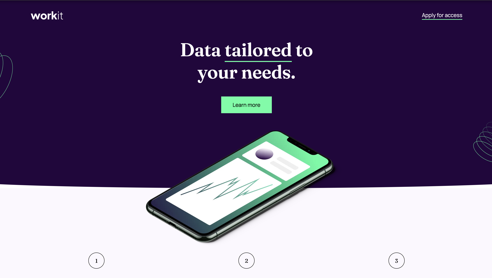
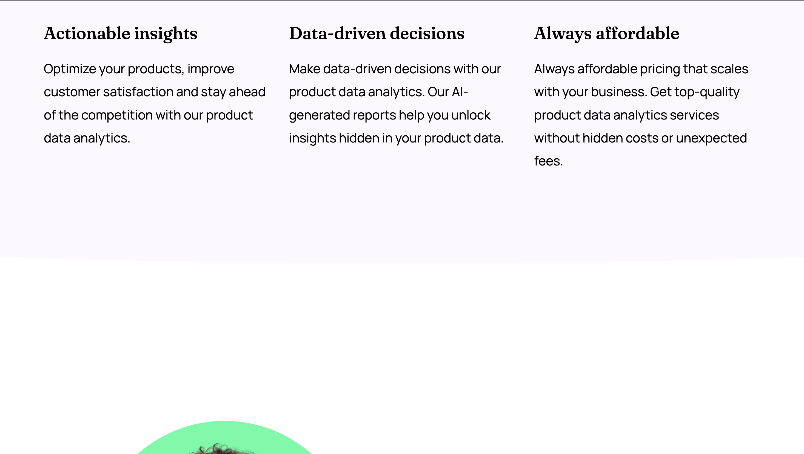
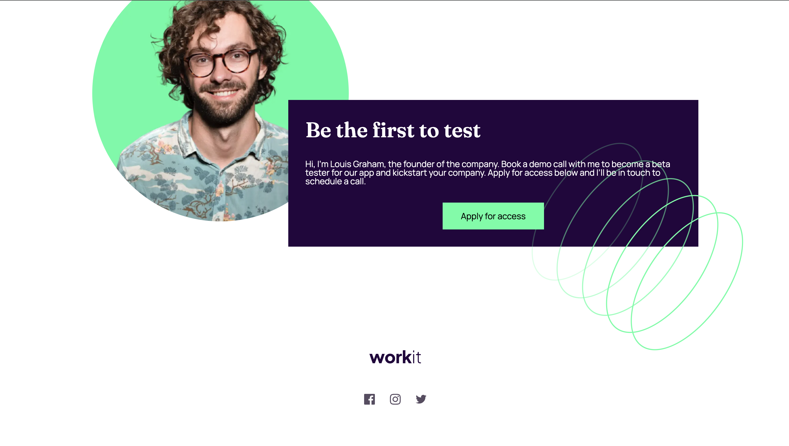

# Frontend Mentor - Workit landing page solution

This is a solution to the [Workit landing page challenge on Frontend Mentor](https://www.frontendmentor.io/challenges/workit-landing-page-2fYnyle5lu). Frontend Mentor challenges help you improve your coding skills by building realistic projects. 

## Table of contents

- [Overview](#overview)
  - [The challenge](#the-challenge)
  - [Screenshot](#screenshot)
  - [Links](#links)
- [My process](#my-process)
  - [Built with](#built-with)
  - [What I learned](#what-i-learned)
  - [Continued development](#continued-development)
- [Author](#author)

**Note: Delete this note and update the table of contents based on what sections you keep.**

## Overview

### The challenge

Users should be able to:

- View the optimal layout for the interface depending on their device's screen size
- See hover and focus states for all interactive elements on the page

### Screenshot

### Links

- Solution URL: [https://github.com/mariagraciaponce/workit-landing-page]
- Live Site URL: [https://mariagraciaponce.github.io/workit-landing-page/]

## My process

### Built with

- Semantic HTML5 markup
- CSS custom properties
- Flexbox
- CSS Grid
- Mobile-first workflow

### What I learned

I'm still learning how to work with Figma, the design properties still confuse me because they change a lot from Mobile to Desktop. I also started working with calc() and with clamp(), they made my life easier on the responsive design but took a couple of tries to understand them (I actually don't think that I fully do).
The curves at the end of the divs where also something that I really struggle with, I ended up using the ellipse property but making sure that it stayed where I wanted it when changing the vw was so hard, I hope that eventually I found out a better way to do it. 
The other thing that I struggled a lot with was the phone image and getting it on the center horinzontally but staying at the end of the div, everytime I change de vw it went wherever it wanted, that was so fustrating and I honestly don't think that I got it right. 

But I'm really happy to say that a understand grid and flexbox really good, that was something that when I started was so hard to wrap my head around.

### Continued development

Using responsive properties and calc() and clamp(), learning about clip-path. 
Using position:absolute to play with the img positioning and making it responsive. 

## Author

- Website - [Add your name here](https://www.your-site.com)
- Frontend Mentor - [@yourusername](https://www.frontendmentor.io/profile/yourusername)
- Twitter - [@yourusername](https://www.twitter.com/yourusername)

